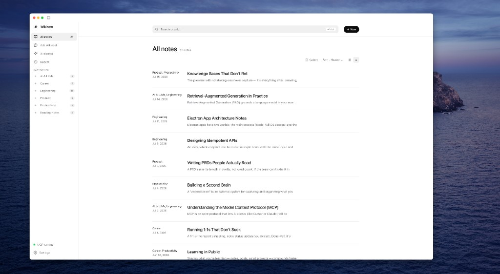
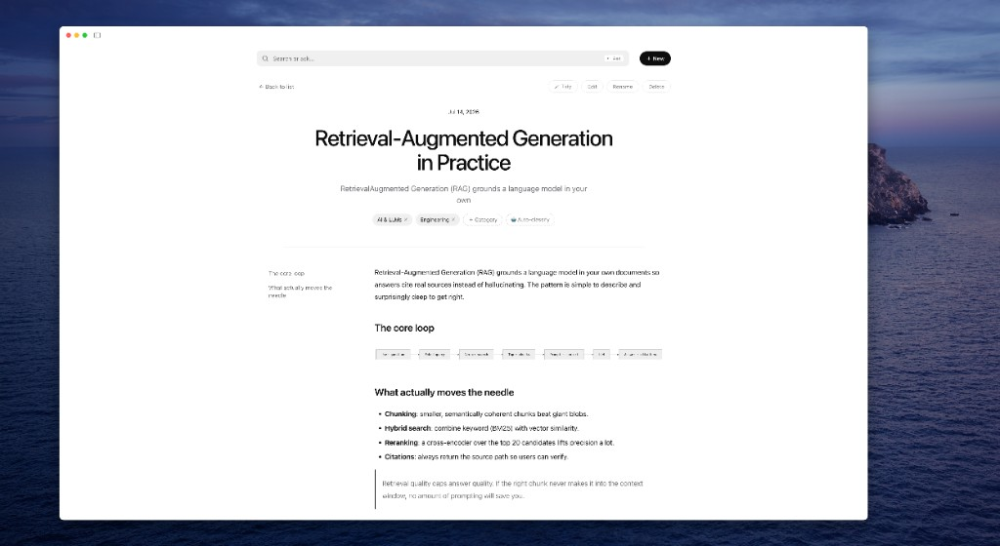

<div align="center">
  
  <h1>Wikinest</h1>
  <p><strong>你的笔记应该随着时间越来越有价值，而不是越来越难用。</strong></p>
  <p>一个本地优先的个人知识收件箱，把随手记录变成整洁、可调用的 Markdown。</p>
  <p>
    <a href="./README.md">English</a> · <strong>简体中文</strong>
  </p>
  <p>
    <a href="https://github.com/qingkongzhiqian/wikinest/releases"></a>
    
    
    <a href="./LICENSE"></a>
  </p>
</div>

<div align="center">
  
  <br /><br />
  
</div>

---

## 你明明保存了，后来却再也找不到

周一，你和 Cursor 讨论出了一个很重要的结论。

周二，你从一篇文章里复制了一段很有启发的文字。周三，你随手写下一个产品想法。到了周五，这些内容已经散落在聊天记录、临时文档、浏览器标签页和一堆 Markdown 文件里。

你告诉自己：以后有时间再整理。

但那个“以后”很少到来。

笔记越来越多，排版越来越乱，原来设计的文件夹和分类逐渐失效。几个月后，你甚至不记得自己写过什么；搜索时只要想不起当初使用的关键词，就像从未记录过一样。

原本为了帮助自己记忆而建立的知识库，慢慢变成了一个不愿打开的地方。

问题从来不是“怎么记下来”。

**真正困难的是记录之后的排版、归类、维护，以及在未来重新找到它。**

## Wikinest 接管记录之后的工作

Wikinest 是一个本地优先的个人知识收件箱。

粗糙的想法、复制的文字、会议记录、研究片段，甚至一段值得保存的 AI 对话，都可以直接丢进来。Wikinest 会把它们整理成规范的 Markdown，归入可复用的分类，并让这些知识持续对你和你的 AI 工具可用。

你只负责记录，Wikinest 负责维护。

等到需要时，你可以按关键词搜索、按语义寻找、直接向知识库提问，也可以让 Cursor 和 Claude 通过 MCP 调用过去沉淀的内容。

```text
随手记录任何内容
        ↓
AI 自动排版和归类
        ↓
Markdown 知识库持续保持整洁
        ↓
未来的人和 AI 都能重新调用
```

## 一个不会随着时间腐烂的知识库

### 记录之前，不需要先整理

你可以直接在编辑器里写，粘贴一大段文字，通过命令行导入，或者让 AI 助手把当前对话存进知识库。

不必先决定放在哪个文件夹，不必想标签，也不必把内容收拾得像一篇完整文章之后才配保存。

### 把维护工作交给 AI

Wikinest 可以：

- 整理标题层级、段落、列表、代码块和标点；
- 自动归类，并优先复用已有分类；
- 根据内容生成更合适的标题；
- 把散落的相关笔记聚合成一篇完整综述。

AI 给出的结果只是起点，不是限制。标题、分类和正文始终由你掌控，随时可以修改。

### 忘记关键词，也能重新找到

记得原话时，用全文搜索；只记得大概意思时，用语义搜索；想直接得到结论时，就向 Wikinest 提问。

回答会附带来源，并能跳回原始笔记。即使知识库已经大到超出你的记忆范围，它仍然可以被使用，而不只是被保存。

## 为 AI 时代而生，但知识始终属于你

AI 很擅长帮助你完成当前这次对话，却不擅长把你的知识带到下一次对话。

Wikinest 为它们补上一个长期记忆层：

- Cursor 和 Claude 可以通过 MCP 写入笔记；
- 它们可以读取和搜索你过去保存的内容；
- 回答以原始笔记为依据，而不是凭空猜测；
- 有价值的结论不会随着聊天窗口关闭而消失。

但你的知识并没有因此被锁进某个 AI 平台。所有笔记仍然是你所选择文件夹里的普通 `.md` 文件。

你可以用其他编辑器打开、自己备份，或使用桌面版内置的 Vault 同步功能在设备间同步。

## 你会得到什么

- **本地优先的 Markdown** —— 笔记始终是你拥有的文件。
- **Vault 切换** —— 任意文件夹都能作为知识库，并可快速切换最近打开的 Vault。
- **AI 自动排版** —— 把随手粘贴的内容整理成可读 Markdown，不改变原意。
- **自动分类** —— 使用可复用的 frontmatter 分类维护笔记。
- **全文与语义搜索** —— 既能按原话找，也能按意思找。
- **问知识库** —— 基于笔记回答问题，并附带原文来源。
- **AI 聚合** —— 把某个分类或手动选择的笔记整理成一篇完整文章。
- **内置 MCP** —— 直接连接 Cursor、Claude Code 和其他 MCP 客户端。
- **图片上传** —— 粘贴或拖拽图片到任意 S3 兼容存储。
- **加密 Vault 同步** —— 通过 S3 兼容对象存储在桌面设备间同步 Markdown。
- **统一 Markdown 编辑器** —— 直接编辑渲染后的 Markdown，并为不支持或异常的文档保留源码回退。
- **中英文界面** —— 在设置中即时切换 English / 简体中文。
- **桌面、Web、Docker 与 CLI** —— 同一个知识库，多种使用方式。

> 即使没有 API Key，Wikinest 仍然是一个快速、本地、纯 Markdown 的个人知识库。配置兼容模型后，AI 功能会自动启用。

## 直接编辑 Markdown

桌面版仍以 Electron 作为运行时。打开笔记后即可直接编辑渲染后的 Markdown；对于支持的内容，不再需要在“编辑/预览”之间切换。停止输入 800ms 后编辑器会自动保存；按 `Cmd/Ctrl+S` 可立即保存。编辑器会把文档重新序列化为 Markdown，因此保存时列表标记、强调符号、空白、缩进和表格布局等语义等价的格式可能被规范化。

编辑器支持 GFM 标题、列表和任务项、链接、表格、围栏代码块、图片和 Mermaid。Mermaid 的源码始终可编辑，即使图表无法渲染也是如此。若文档无法解析、编辑器初始化失败，或特殊 Markdown 需要源码级修复，可使用 **查看 Markdown 源码** 回退入口。

每次保存都会携带读取笔记时的版本。如果文件被当前编辑器外部修改，Wikinest 会保留草稿而不是覆盖另一版本，并创建 Markdown 冲突副本。切换笔记或退出应用前，应用会 flush 尚未写入的保存。

AI 遵循选区优先：编辑器存在非空选区时，默认只发送选区。只有捕获的选区仍然有效时，AI 结果才可替换选区或插入其后；写回操作可以撤销，并继续经过普通的保存和冲突检查。

## 从桌面版开始

当前 [GitHub Releases](https://github.com/qingkongzhiqian/wikinest/releases) 中提供链接的版本仅适用于 macOS。

| Mac | 下载 |
| --- | --- |
| Apple Silicon — M1、M2、M3、M4 或 M5 | [下载 DMG](https://github.com/qingkongzhiqian/wikinest/releases/download/v1.0.1/Wikinest-1.0.1-arm64.dmg) |
| Intel | [下载 DMG](https://github.com/qingkongzhiqian/wikinest/releases/download/v1.0.1/Wikinest-1.0.1.dmg) |

Windows 和 Linux 是受支持的构建目标；此处没有已发布安装包的链接，可自行从源码构建。

首次启动时，选择一个文件夹作为 Vault。Wikinest 会记住它，之后可以通过 **文件 → 打开文件夹…** 或 **打开最近** 随时切换。

界面语言、大模型、Embedding、图片存储、Vault 同步和本地 MCP 连接方式都可以在 **设置** 中管理。

### 从源码运行

需要 Node.js 18 或更高版本：

```bash
git clone https://github.com/qingkongzhiqian/wikinest.git
cd wikinest
npm install
npm run desktop
```

## 同步桌面 Vault

桌面版可以通过 AWS S3、Cloudflare R2、阿里云 OSS、MinIO 或其他 S3 兼容对象存储双向同步 Vault。Vault 同步按 Vault 单独配置，并且完全独立于图片存储：不会复用图片的 `S3_*` 配置，也不会混用图片对象。

同步范围仅包括 `.md` 文件，不会上传 `.index/`、本地设置或同步状态，也不会上传笔记引用的图片对象。

### 配置设备

1. 在首台设备打开 **设置 → Vault 同步**，选择服务商，填写 endpoint/region、bucket、prefix、访问凭据，以及可选的同步密码。
2. 测试连接，然后保存并启用同步；必须等这台设备首次同步成功后，才能配置其他设备。
3. 在每台后续设备打开需要参与同步的本地 Vault，配置完全相同的 endpoint/region、bucket、prefix 和同步密码。

请使用私有 bucket，并将凭据限制为所选 prefix 及 Wikinest 必需的读、写、删除和列举权限。AWS IAM 必须同时授予 bucket 上的 `s3:ListBucket`（通过 `ListObjectsV2` 使用）以及 prefix 下的对象权限。连接测试会写入、读取、列举并删除一个临时探针对象。桌面凭据通过操作系统安全存储保存。不要在 `.env` 中填写 Vault 同步凭据。

### 加密与已初始化 prefix

同步密码留空时，笔记路径和内容会以明文写入 bucket。**即使使用私有 bucket，这仍是显著的隐私风险。**设置密码后，Wikinest 使用 scrypt 派生密钥，并以 AES-256-GCM 加密路径和内容。密码无法找回；如果所有已配置设备都遗忘密码，远端数据将无法恢复。

新的空 prefix 只能由一台首设备初始化。禁止多台设备并发初始化，尤其禁止使用不同密码或不同明文/加密模式并发初始化。必须等首台设备首次同步成功后，再配置后续设备。同步协议 v1 依赖这项“单初始化者”限制，因为 S3 兼容存储没有可移植的 metadata 比较并交换（CAS）能力。

首台设备会把 prefix 初始化为明文或密码加密模式。已初始化 prefix 的模式和密码不能原地切换。若要切换模式/密码或迁移到其他远端，只在首台设备上配置一个新的空 prefix。Wikinest 会按新远端身份创建独立的本地同步状态，并把当前本地 `.md` 文件作为新库的首批内容上传，不会引用旧 prefix 的 blob。首次同步成功后再配置其余设备。旧 prefix 会保留，且不会自动删除。

### 时序与行为

- Vault 启动时、每 60 秒、本地写入约 2 秒后都会同步；退出时还会再同步一次，最多等待 15 秒。
- 离线或暂时失败不会破坏本地笔记，后续同步会自动重试。
- 并发编辑不会静默覆盖其中一个版本，而是保留为 Markdown 冲突副本。
- 删除和重命名都会同步。重命名按“删除旧路径 + 新建新路径”处理，因此并发离线修改可能产生冲突副本。
- 同步协议 v1 使用仅追加的远端操作日志，不会对旧的远端日志对象执行垃圾回收（GC）。
- 同一设备上的同一 Vault 只能运行一个 Wikinest 实例；每台设备的本地同步状态必须只有一个写者。

启用 Vault 同步后，不要再用 Git、iCloud Drive、Dropbox、OneDrive 或其他文件夹同步工具同步同一个 Vault。两个独立同步器可能互相竞争，导致文件重复、已删除文件复活或产生冲突。正常编辑仍受支持，Wikinest 也会在物化远端内容前检测外部变更；但 POSIX/Node 没有可移植的原子文件比较并交换能力，因此同步物化提交临界瞬间的第三方写入无法获得跨进程强事务保证。启用同步时，不要让其他同步器或自动保存工具并发修改同一文件。

## 连接 Cursor 或 Claude Code

桌面 App 会启动一个稳定的本地 MCP 地址：

```text
http://127.0.0.1:4321/mcp
```

点击 Wikinest 左下角的 **MCP 运行中**，即可复制当前地址，以及 Cursor 和 Claude Code 可以直接使用的配置。

连接后，你可以让 AI 助手：

- 把当前结论保存到知识库；
- 创建或更新笔记；
- 搜索以前记录过的内容；
- 整理现有笔记；
- 聚合某个分类；
- 根据整个知识库回答问题。

可用工具包括 `save_conversation`、`write_note`、`read_note`、`list_notes`、`search_notes`、`tidy_note`、`synthesize_category` 和 `ask_wiki`。

## 配置 AI 功能

Wikinest 支持 OpenAI 兼容接口，包括 OpenAI、DeepSeek、通义千问和自托管模型。

桌面版可以直接在 **设置** 中填写。CLI、Docker 或 Web 部署可以使用环境变量：

```bash
LLM_BASE_URL=https://api.example.com/v1
LLM_API_KEY=你的-api-key
LLM_MODEL=你的模型
```

Embedding 用于语义搜索和知识库问答。它会在兼容时复用 LLM 配置，也可以通过 `EMBED_*` 单独设置。

### 使用 AI 助手

AI 助手收起时，在 Wikinest 的任何位置都可以通过右侧边缘垂直居中的悬浮按钮重新打开。它复用现有的 `LLM_BASE_URL`、`LLM_API_KEY` 和 `LLM_MODEL` 配置，并支持创建、切换多个临时线程。

在宽屏上，助手以推开页面内容的抽屉打开，而不是覆盖页面。抽屉默认宽度为 380px，可在 320px 到 560px 之间拖动调整。在窄屏上，助手使用独立视图，让对话占用完整视口。

上下文遵循选区优先原则：

- **选区（Selection）** —— 默认只发送选区。只有显式开启 **附带全文**，才会同时发送完整草稿。该授权是瞬时的，并会在离开选区上下文时重置。选区回答可以复制，也可以替换捕获的选区或插入到选区之后。
- **文档（Document）** —— 阅读笔记时，或编辑时没有选区，Wikinest 会发送当前笔记，以便总结、解释或围绕它提问。文档模式的回答只能复制，不能自动写回。
- **通用（General）** —— 在索引页或其他没有文档上下文的视图中，Wikinest 不会发送笔记内容。

已配置的模型服务商会收到你的指令、当前临时线程中符合条件的历史，以及仅限本次请求获授权的上下文。请保持请求精简；除非你信任服务商及其数据处理政策，否则不要发送敏感内容。

请求失败时会明确区分限流（`429`）、身份验证或 API Key 问题、模型无效或不可用、网络连接问题和请求超时。**重试**始终需要手动触发，并会在重试时重新捕获选区、全文授权及其他当前上下文，而不会重发过期的上下文快照。

线程和抽屉宽度都只保存在内存中。刷新页面或退出应用后，线程会消失，宽度会恢复为默认的 380px；两者都不会写入 Vault，也不会通过对象存储同步。

选区写回有安全保护：只有原选区和草稿身份仍然匹配时，Wikinest 才会应用结果。如果模型回答期间任一内容发生变化，替换和插入都会被拒绝，避免覆盖之后的新编辑；复制仍然可用。AI 输出绝不会自动保存，请先检查结果，再自行保存笔记。

图片上传支持 AWS S3、Cloudflare R2、阿里云 OSS、MinIO 和其他 S3 兼容服务。完整配置见 [`.env.example`](./.env.example)。

## 自托管

通过 Docker 运行 Web 与 MCP 服务：

```bash
cp .env.example .env
docker compose up -d --build
```

笔记会保存在宿主机的 `./content` 中，项目附带的 Compose 配置使用 Caddy 提供 HTTPS。

暴露到公网前，请务必配置：

- `WIKI_PASSWORD`：保护 Web 页面；
- `WIKI_TOKEN`：保护 MCP 接口。

服务默认不启用认证，缺少配置时会在启动日志中明确警告。

## 命令行

```bash
echo "# 今天" | wiki add journal/2026-07-14
wiki search "产品定位"
wiki tidy journal/2026-07-14
wiki digest "机器学习"
```

## 开发

```bash
npm install
npm test
npm run desktop
```

构建安装包：

```bash
npm run dist:mac
npm run dist:win
npm run dist:linux
```

## 许可证

社区核心依据 [GNU AGPLv3](./LICENSE) 开源。需要在不承担 AGPL 义务的情况下分发、嵌入或运营 Wikinest 的组织，可以申请单独的商业许可。

官方商业版未来可能包含不属于本社区仓库的闭源付费功能。详细说明请参阅 [LICENSING.zh-CN.md](./LICENSING.zh-CN.md)。

版权所有 © 2026 Wise Future Innovations Limited。

---

<p align="center">
  <strong>放心记录，留下价值。</strong>
</p>
